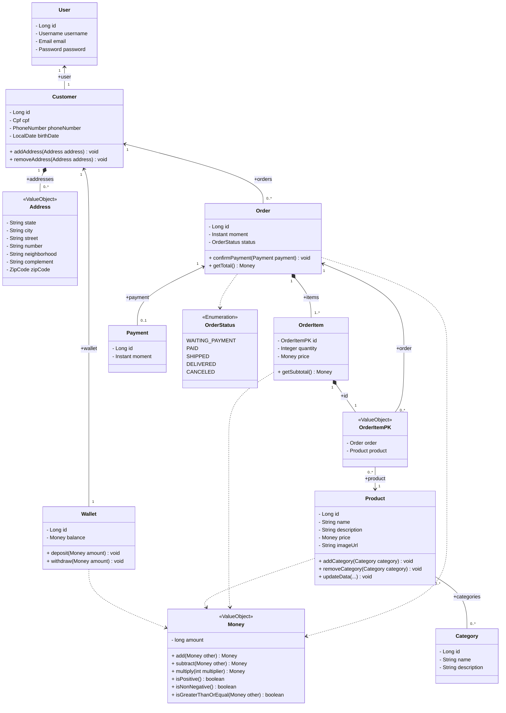

# Documentação do Domínio e Diagrama de Classes UML

Esta documentação descreve a arquitetura conceitual de alto nível e as estruturas de dados (Entities e Value Objects) presentes no domínio do sistema.

## 1. Diagrama de Classes UML (Conceitual)

Este diagrama representa as entidades principais do domínio e seus relacionamentos utilizando a notação UML.


<!-- O diagrama acima é uma representação visual mais organizada. Abaixo, fornecemos o código Mermaid para facilitar a reprodução e visualização em outras ferramentas de modelagem e no próprio editor de código. -->



## 1.1 Mapa Visual Simplificado de Relacionamentos (Guia para o Astah)

**Legenda de Símbolos Simplificados:**
*   `-->` : **Associação / Referência Comum** (A seta aponta para quem está sendo referenciado. Ex: `A --> B` significa que A conhece/tem B).
*   `--` : **Associação Mútua** (Ambos se conhecem igualmente).
*   `*--` : **Composição (Dependência Existencial)** (O asterisco `*` representa o losango preenchido da UML e fica sempre do lado da classe "Todo" (Dono). Ex: `Todo *-- Parte`).
*   `..>` : **Uso de Tipo / Value Object** (A classe usa um tipo de dado simples ou Enum).

### Visualização dos Blocos:

```text
[BLOCO DO CLIENTE]
Customer --> User      (O Cliente possui 1 Usuário de acesso)
Customer *-- Address   (O losango fica no Cliente. O Endereço depende dele para existir)
Customer --> Wallet    (O Cliente possui 1 Carteira)

[BLOCO TRANSACIONAL / PEDIDOS]
Order --> Customer     (O Pedido sabe a qual Cliente pertence)
Order *-- OrderItem    (O losango fica no Pedido. O Item depende dele para existir)
OrderItem *-- OrderItemPK (O losango fica no Item. A chave pertence a ele)
OrderItemPK --> Order  (A chave referenciando o Pedido)
Order --> Payment      (O Pedido possui 1 Pagamento)
Order ..> OrderStatus  (O Pedido usa o Enum de Status)

[BLOCO DO CATÁLOGO]
OrderItemPK --> Product (A chave aponta para qual Produto foi comprado)
Product -- Category   (Produto e Categoria se relacionam mutuamente - Muitos-para-Muitos)

[USO DE DINHEIRO (VALUE OBJECT)]
Wallet ..> Money       (Carteira usa o tipo Dinheiro)
Product ..> Money      (Produto usa o tipo Dinheiro)
OrderItem ..> Money    (Item do Pedido usa o tipo Dinheiro)
Order ..> Money        (Pedido usa o tipo Dinheiro)
```

## 2. Dicionário do Diagrama e Detalhamento das Classes

Abaixo está o detalhamento que acompanha o diagrama, especificando a natureza das classes, suas propriedades e como elas se associam.

### 2.1 Entidades (Entities)
Objetos que possuem identidade única (um `Id`) ao longo do tempo.

| Entidade | Descrição | Atributos Principais | Justificativa das Multiplicidades |
| :--- | :--- | :--- | :--- |
| **User** | Representa o usuário de acesso ao sistema (autenticação). | `id`: Long<br>`username`: Username (VO)<br>`email`: Email (VO)<br>`password`: Password (VO) | (Sem multiplicidade direta originada daqui, apenas alvo de `Customer`). |
| **Customer** | Representa um cliente da loja, os dados físicos e de entrega. | `id`: Long<br>`cpf`: Cpf (VO)<br>`phoneNumber`: PhoneNumber (VO)<br>`birthDate`: LocalDate | **1 para 1 (com User)**: Cada cliente possui exatamente um login de acesso ao sistema.<br>**1 para N (com Address)**: Um cliente pode ter vários endereços (ex: casa, trabalho).<br>**1 para 1 (com Wallet)**: Cada cliente é dono de apenas uma carteira digital.<br>**1 para N (com Order)**: Um mesmo cliente pode fazer dezenas de pedidos ao longo do tempo. |
| **Wallet** | Representa a carteira digital do cliente para armazenar saldo. | `id`: Long<br>`balance`: Money (VO) | **1 para 1 (com Customer)**: Uma carteira digital pertence única e exclusivamente a um cliente. |
| **Product** | Representa o catálogo de produtos disponíveis para venda. | `id`: Long<br>`name`: String<br>`description`: String<br>`price`: Money (VO)<br>`imageUrl`: String | **N para N (com Category)**: Um produto (ex: "Smartphone") pode estar em várias categorias ("Eletrônicos", "Promoções"), e uma categoria possui vários produtos. |
| **Category** | Representa uma categoria que agrupa produtos. | `id`: Long<br>`name`: String<br>`description`: String | **N para N (com Product)**: Uma mesma categoria agrupa e organiza múltiplos produtos. |
| **Order** | Representa um pedido efetuado no sistema. | `id`: Long<br>`moment`: Instant<br>`status`: OrderStatus (Enum) | **N para 1 (com Customer)**: Cada pedido pertence a apenas um cliente que o comprou.<br>**1 para 1 (com Payment)**: Um pedido é quitado por um único registro de pagamento.<br>**1 para N (com OrderItem)**: Um pedido é como um "carrinho" que contém um ou mais itens comprados juntos. |
| **OrderItem** | Representa os itens individuais pertencentes a um Pedido. (Conceitualmente, é a **Classe Associativa** entre `Order` e `Product`). | `id`: OrderItemPK (VO)<br>`quantity`: Integer<br>`price`: Money (VO) | **N para 1 (com Product)**: Este item de pedido aponta para apenas um produto do catálogo que está sendo comprado.<br>**N para 1 (com Order)**: Este item pertence a apenas um único pedido. |
| **Payment** | Representa o pagamento finalizado de um pedido. | `id`: Long<br>`moment`: Instant | **1 para 1 (com Order)**: O registro do pagamento é atrelado de forma exclusiva ao pedido que ele quitou. |

### 2.2 Tipos e Value Objects (VO)
Objetos caracterizados por seus atributos (imutáveis) sem uma identidade exclusiva no banco de dados.

*   **Money**: Centraliza regras de negócio sobre dinheiro (usando `long` para evitar erros de ponto flutuante). **Operações**: `add()`, `subtract()`, `multiply()`, `isPositive()`. 
*   **Address**: Componente embutido (`@Embeddable`) que agrupa estado, cidade, rua, número, etc.
*   **OrderItemPK**: Classe auxiliar (`@Embeddable`) usada como chave primária composta para identificar unicamente um `OrderItem`. Ela não é a classe associativa em si, mas sim a **identidade (ID técnico)** da classe associativa `OrderItem`. Ela encapsula as referências para o `Order` e o `Product` para o banco de dados (JPA/Hibernate), garantindo que um mesmo produto não seja inserido duas vezes como itens separados no mesmo pedido.
*   **Encapsuladores Primitivos (Tiny Types)**: `Username`, `Email`, `Password`, `Cpf`, `PhoneNumber`, `ZipCode`. Garantem regras de validação intrínsecas ao próprio formato dos dados.

### 2.3 Enumeradores (Enums)
Tipos que consistem em um conjunto fixo de constantes.

*   **OrderStatus**: Representa os possíveis estados do ciclo de vida de um pedido.
    *   `WAITING_PAYMENT` (Aguardando Pagamento)
    *   `PAID` (Pago)
    *   `SHIPPED` (Enviado)
    *   `DELIVERED` (Entregue)
    *   `CANCELED` (Cancelado)
